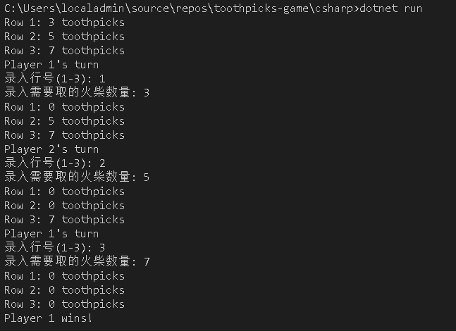
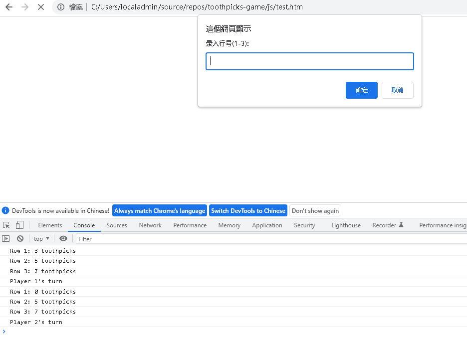

<!--
 * @Date: 2022-12-07 16:22:14
 * @LastEditors: Jason Chen
 * @Blog: https://www.cnblogs.com/smallidea
 * @LastEditTime: 2022-12-07 17:02:16
 * @FilePath: /toothpicks-game/README.md
-->
# toothpicks-game

## 需求
游戏设定：
将15根牙签，分成三行，每行自上而下（其实方向不限）分别是3、5、7根， 安排两个玩家，每人可以在一轮内，在任意行拿任意根牙签，但不能跨行，拿最后一根牙签的人即为输家。

## 分析
- 模拟玩家1、2进行选行和选牙签，游戏规则简单而又有一定的可操作性

## 开发
开发工具：vscode，语言：C#、Javascript
说明：
- 分别使用 javascript、C# 写完了代码，时间关系type script代码没有写，其实基本逻辑是一样的
  - C# 采用命令行的标准输入、输出的方式进行交互
  - js 使用弹窗的形式进行交互，输出f12见console
- Jupyter Notebook 的方式有点折腾，后续再做


## 调试效果
### C# 
```
cd csharp
dotnet run
```


### js
进入 js 文件夹，打开 test.htm 文件

